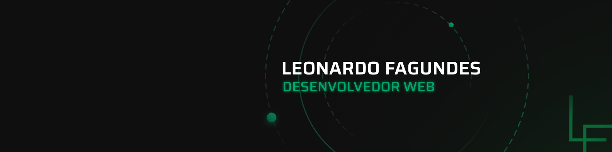

<h2>Portfólio - Leonardo Fagundes</h2>

Esse é meu <span style="color: #01A66B;">portfólio pessoal</span> que criei para falar um pouco mais sobre mim e apresentar meus <span style="color: #01A66B;">projetos</span> , <span style="color: #01A66B;">certificados</span> e <span style="color: #01A66B;">habilidades</span> através de uma <span style="color: #01A66B;">interface agradável</span>!

> Deploy: <a href="leofagundes.dev.br" style="color: #01A66B; text-decoration: underline;">leofagundes.dev.br</a>

<h3>Tecnologias usadas</h3>

- React
- Styled-Components
- Figma

<h3>Inicialização</h3>

```
// instale as dependências
npm install

// inicialize o projeto
npm start
```

<h3>Licença</h3>

- Você é livre para usar esse código como inspiração
- Remova todas minhas informações pessoais em caso de uso
